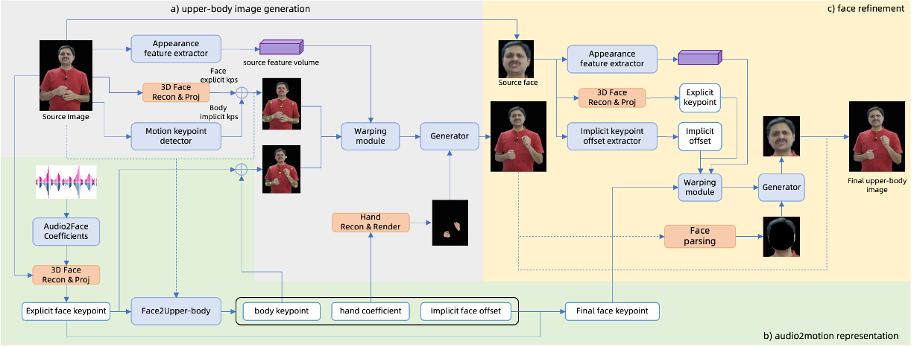

# ChatAnyone
ChatAnyone: Stylized Real-time Portrait Video Generation with Hierarchical Motion Diffusion Model

[Jinwei Qi](https://dblp.org/pid/183/0937.html),
[Chaonan Ji](https://dblp.org/pid/189/3461.html),
[Sheng Xu](https://dblp.org/pid/10/1887-7.html),
[Peng Zhang](https://dblp.org/pid/21/1048-80.html),
[Bang Zhang](https://dblp.org/pid/11/4046.html),
[Liefeng Bo](https://scholar.google.com/citations?user=FJwtMf0AAAAJ&hl=zh-CN)

Tongyi Lab, Alibaba Group



## Citation	

```
@article{qi2025chatanyone,
  title={ChatAnyone: Stylized Real-time Portrait Video Generation with Hierarchical Motion Diffusion Model},
  author={Jinwei Qi and Chaonan Ji and Sheng Xu and Peng Zhang and Bang Zhang and Liefeng Bo},
  journal={arXiv preprint:2503.21144},
  year={2025}
}
```